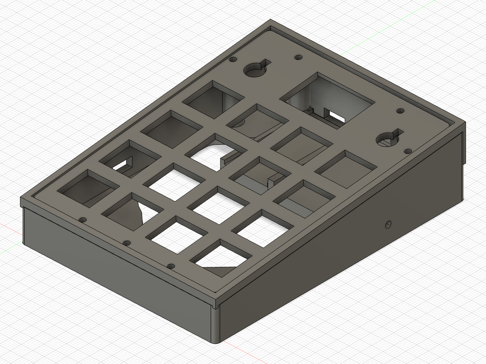
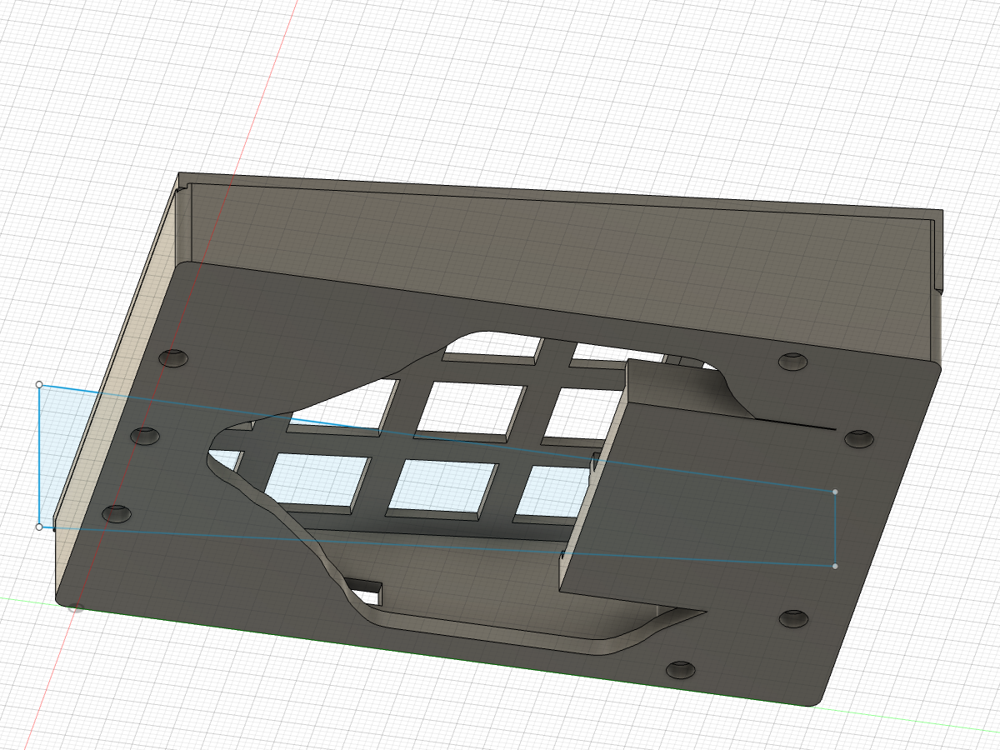
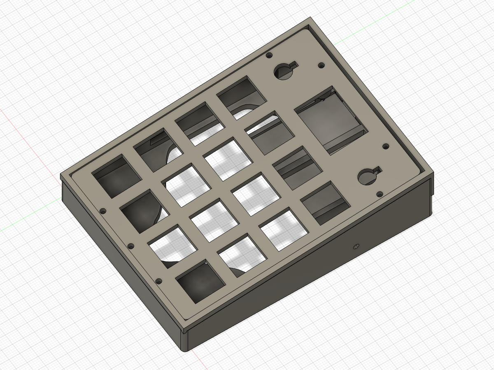
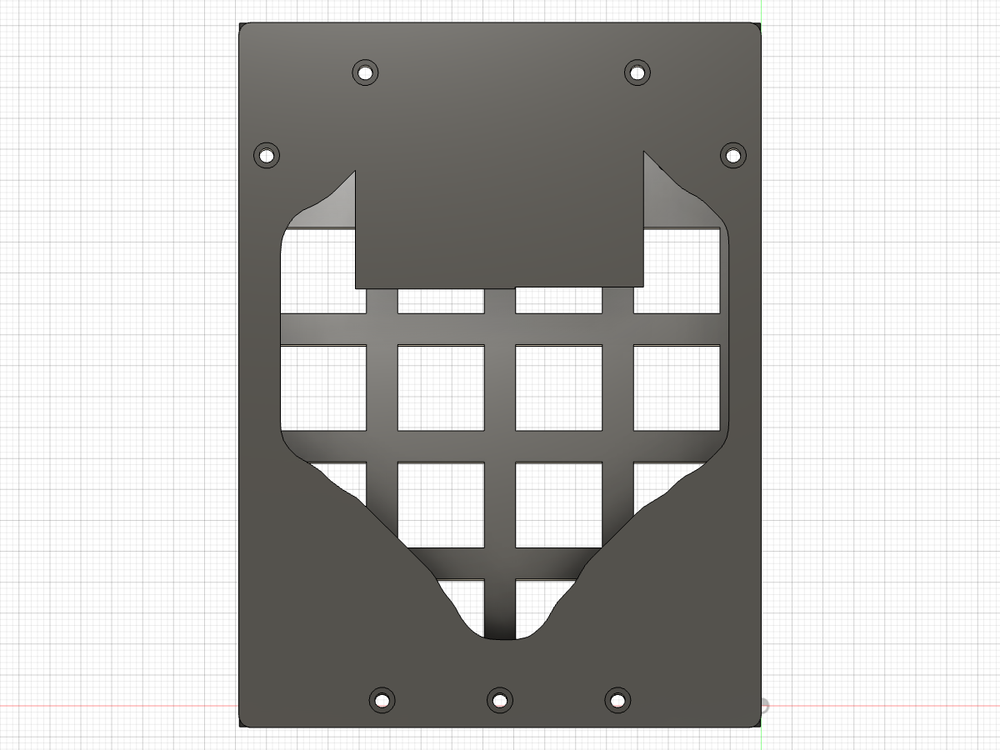
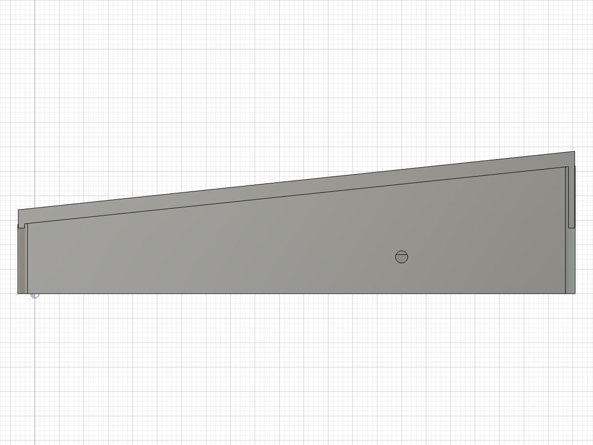
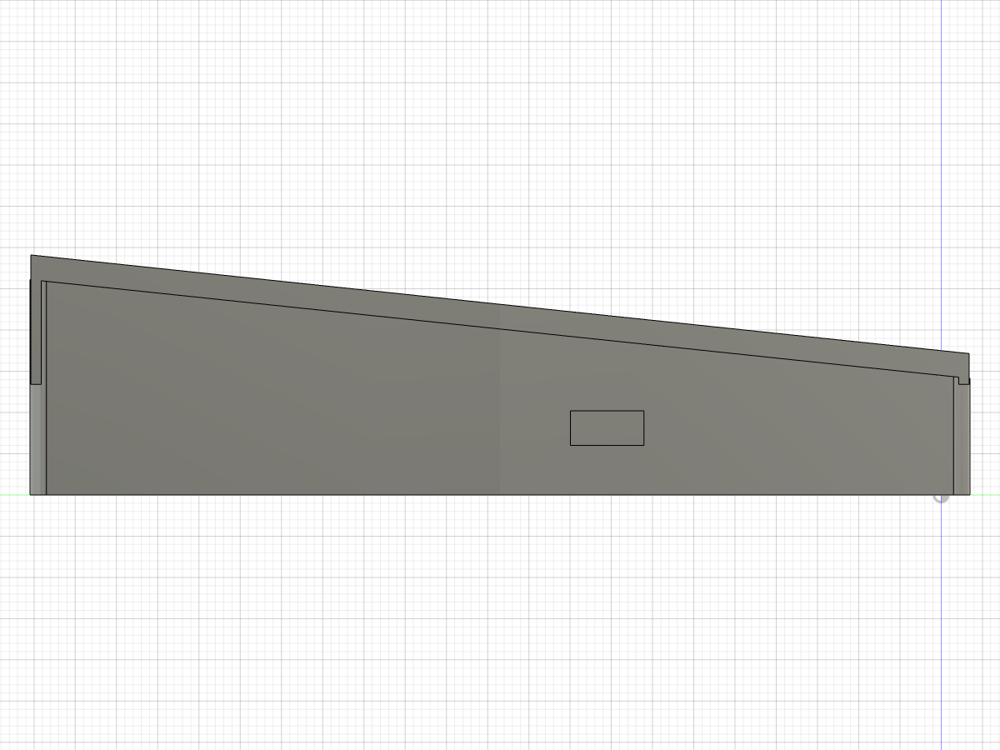
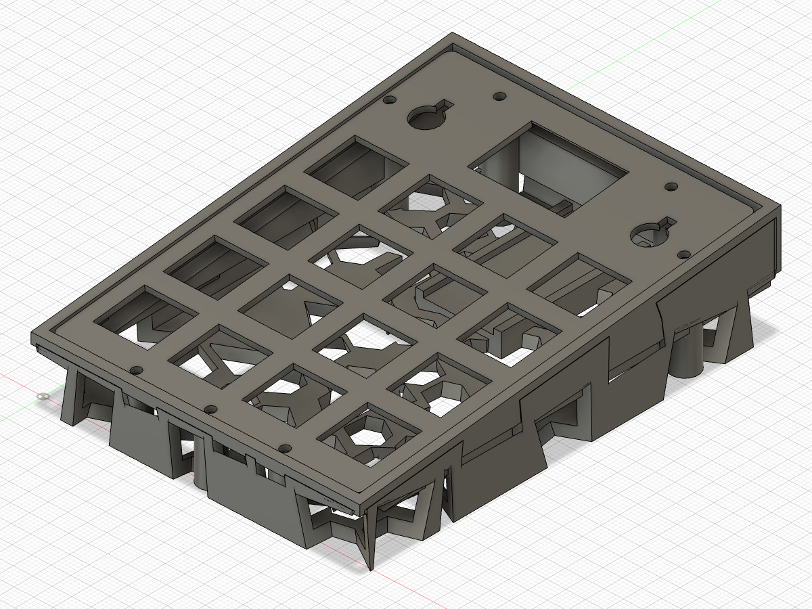

# void16-redux-mod

A heavily modified [VOID16](https://github.com/victorlucachi/void16) — 4×4 handwired
macropad with two EC11 encoders, an SSD1306 OLED, a **real topology-optimised**
base, and a nice!nano v2 running ZMK.



---

## What it is

| | |
|---|---|
| Layout | 4×4 MX grid (19.05mm pitch) + 2× EC11 encoders flanking an OLED window |
| Controller | nice!nano v2 (nRF52840, BLE, USB-C charging) |
| Display | SSD1306 I²C OLED, 128×32 (0.91"/0.96") |
| Battery | 402030 LiPo 200mAh (charges via USB-C) |
| Case | 3D printed, 114 × 84.45mm, 6° wedge profile, two parts |
| Firmware | ZMK (`firmware/`), 2 layers + encoder behaviours + OLED status |

### Design highlights

- **Topology-optimised base** — a real SIMP solver (2D density method, ~135
  iterations) ran on the actual load case: seven post loads transferred to the
  side-wall supports, wall band and post pads locked as non-design solids.
  Compliance dropped **208.6 → 36.77 (5.7× stiffer)** at 32% volume fraction.
  The converged field was extracted as one simply-connected smooth void
  (no floating islands → prints support-free), spline-fitted, cut with a 4°
  taper and a flowing inset top-step for the generative "sweep" finish.
  
- **Recessed top plate** — 2.5mm plate (MX-clip compatible) drops into a 3mm
  lip collar, captured on all edges, clamped by **7 bottom-up M2 heat-set
  posts** (nothing visible on the plate top).
- **Centred MCU + battery module** — nice!nano pedestal with side guides and a
  same-length, same-height battery tray (PCB and battery rest at z=4.5).
- **Hardware details** — power-switch slot in the left wall, Ø2.5 reset
  pinhole in the right wall (paperclip reset; double-press = bootloader),
  USB-C cutout in the back wall, OLED window with a 3.5mm bezel reveal and
  1mm component-relief channels above and below the screen.
- **MCU relief** — the back-left post corner is relieved to z=9.5 (+1mm over
  the USB-C port) so the nice!nano drops in without touching the TO structure.

### Version history (condensed)

| Ver | Change |
|---|---|
| v1–v5 | 1.5→…→3/4mm thinner plate, centring, pin slot +1mm, LCD bezel + channels |
| v6 | interior posts removed (switch-PCB interference) → perimeter heat-sets |
| v8–v13 | voronoi base (random → hex → stress-graded), centre-support experiments |
| v14 | **real SIMP topology optimisation** replaces all lattice work |
| v16–v17 | centred MCU+battery module, synced trays (same length/height) |
| v18 | sweepy TO finish: spline contour, 4° taper, inset top-step |
| v20 | wall windows reverted; plate 1.5→2.5mm, collar 2→3mm |
| v21 | base sliver fix (clearance = exact pad blanket) |
| v22 | switch slot −0.1mm; reset pinhole added |
| v23 | MCU relief (post corner → z 9.5), top plate frozen |


---

## Gallery

| | |
|---|---|
|  |  |
| *v23 assembly — TO base, recessed plate, centred module* | *MCU zone — relief cut, pedestal + battery bay* |
|  |  |
| *Underside — SIMP-optimised web* | *Sweepy finish: splines, 4° taper, top-step* |
|  |  |
| *Right wall — reset pinhole (y75)* | *Left wall — power-switch slot* |
|  | |
| *v12 — the hex-voronoi era (superseded)* | |

---

## Bill of materials

### Printed parts (`cad/`)
| Part | File | Notes |
|---|---|---|
| Bottom | `bottom-plate.stl` | print floor-down, no supports |
| Top plate | `top-plate.stl` | print flat; 2.5mm — test MX clip bite on a scrap first |
| Fit coupon | `screen-encoder-slice.stl` | screen/encoder/gap test slice — print before committing |

### Hardware
| Part | Spec | Qty |
|---|---|---|
| Heat-set inserts | M2×4 brass | 7 |
| Screws | M2×25 socket (4 tall posts) / M2×14 (3 front posts) | 7 |
| Switches | MX, on per-switch PCBs w/ 1N4148 | 16 |
| Keycaps | any | 16 |
| Encoders | EC11 plate-mount | 2 |
| OLED | SSD1306 I²C 128×32 | 1 |
| Controller | nice!nano v2 | 1 |
| Battery | 402030 LiPo 200mAh w/ PCM | 1 |
| Power switch | MSK-12C02-family SPDT slide | 1 |
| Reset button | 6×6×5h horizontal tactile w/ bracket | 1 |
| Wire | 24AWG buses / 26AWG signals | ~2m |

Full wiring diagram + firmware guide: **[`firmware/WIRING.md`](firmware/WIRING.md)**.

---

## Printing & assembly

1. Print all three parts (0.4mm nozzle; the TO base is support-free by
   construction). Test-fit switches and the LCD/encoders on the coupon.
2. Press 7 heat-set inserts into the post tops (iron from inside the case).
3. Handwire the matrix per `firmware/WIRING.md` (diode stripe → ROW bus),
   wire encoders, OLED, power switch (series with battery +), reset button
   (RST→GND behind the right-wall pinhole).
4. Drop the nice!nano into the pedestal guides (USB-C through the back slot),
   battery into the bay, wires across the web (hot-glue down).
5. Flash (see below), test, then seat the plate into the collar and drive the
   seven M2 screws from underneath.

## Firmware

`firmware/` is a self-contained ZMK config (also usable standalone — see its
own `WIRING.md`):

```
cd firmware
./build.sh                    # → staged-zmk.uf2
# double-tap reset (pinhole ×2) → NICEBOOT drive appears
cp staged-zmk.uf2 /Volumes/NICEBOOT/ && diskutil eject NICEBOOT
```

Default layers: **0** numpad + FN hold · **1** F1–F16. Encoder L = volume /
pgup-pgdn, encoder R = track / home-end. OLED shows battery/output/layer.

A prebuilt `staged-zmk.uf2` is committed for first flash.

## Repository layout

```
cad/                     printable STLs, STEP, native .f3d (v23)
cad/v23_rebuild.py       deterministic Fusion 360 rebuild script (exec via API)
cad/tools/               SIMP solver + converged field JSONs (reproduce the TO base)
firmware/                ZMK config, WIRING.md, prebuilt UF2
docs/images/             renders
```

## Credits

- Original VOID16 design: [victorlucachi/void16](https://github.com/victorlucachi/void16)
- Firmware: [ZMK](https://zmk.dev) · Hardware: nice!nano by Nice Keyboards
